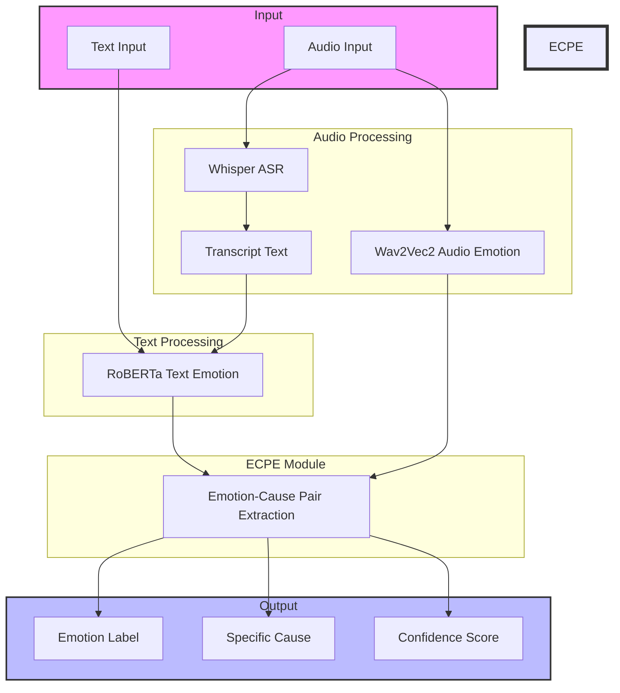

<div align="center">


# 🧠 MultiCauseNet
### Multimodal Emotion-Cause Pair Extraction (ECPE)

[](https://www.python.org/)
[](https://pytorch.org/)
[](https://huggingface.co/docs/transformers/index)
[](LICENSE)

**MultiCauseNet** is a state-of-the-art multimodal framework designed to not only identify emotions in text and audio but also extract the specific **causes** behind those emotions. Built for explainable AI research and high-performance applications.

[Quick Start](#-getting-started) • [Features](#-key-features) • [Architecture](#-system-architecture) • [Usage](#-how-to-use)

</div>

---

## 🌟 Key Features

- 🎭 **Multimodal Analysis**: Seamlessly process both **Text** and **Audio** inputs.
- 🔍 **Emotion-Cause Pair Extraction (ECPE)**: Goes beyond classification to provide the *why* behind every emotion.
- 🎤 **Advanced Audio Pipeline**: Uses **OpenAI Whisper** for ASR and **Wav2Vec2** for vocal emotion recognition.
- 📝 **Deep NLP**: Powered by **RoBERTa** for high-accuracy text emotion detection.
- 🔒 **100% Offline**: Privacy-focused architecture where all models run locally on your hardware.
- 🎨 **Dual Interface**: Choice between a professional **Flask Web App** and a rapid **Streamlit Dashboard**.

---

## 🏗️ System Architecture



---

## 🚀 Getting Started

### 1. Prerequisites
- Python 3.8 or higher
- FFmpeg (required for audio processing)

### 2. Installation
Clone the repository and install the dependencies:
```bash
git clone https://github.com/MujtabaNite/MultiCauseNet-multimodal-emotion-cause-pair-extraction.git
cd MultiCauseNet-multimodal-emotion-cause-pair-extraction
pip install -r requirements.txt
python -m spacy download en_core_web_sm
```

### 3. Download AI Models
Before running the application, download the pre-trained weights (approx. 2-3 GB):
```bash
python models/download_models.py
```

---

## 🖥️ How to Use

MultiCauseNet offers two ways to interact with the models:

### Option A: Flask Web Interface (Recommended)
Best for professional demonstrations with a modern, animated UI.
```bash
python app_flask.py
```
*Access at: `http://localhost:5000`*

### Option B: Streamlit Dashboard
Best for rapid testing and detailed model output inspection.
```bash
streamlit run app.py
```
*Access at: `http://localhost:8501`*

---

## 🧠 AI Models Inventory

| Component | Model Architecture | Role |
| :--- | :--- | :--- |
| **Text Emotion** | `RoBERTa-distil` | Deep semantic emotion classification |
| **Audio ASR** | `OpenAI Whisper` | High-fidelity speech-to-text |
| **Audio Emotion** | `Wav2Vec2-LG-XLSR` | Acoustic feature-based emotion recognition |
| **ECPE Engine** | `Rule-based + NLP` | Linguistic dependency-based cause extraction |

---

## 📁 Project Structure

```text
MultiCauseNet/
├── app_flask.py          # Professional Flask Backend & UI
├── app.py                # Streamlit Prototype
├── pipelines/            # Core AI Processing Modules
│   ├── ecpe_module.py    # Emotion-Cause Extraction Logic
│   ├── text_pipeline.py  # RoBERTa processing
│   └── audio_pipeline.py # Whisper & Wav2Vec2 processing
├── models/               # Model weights storage (ignored by Git)
├── static_flask/         # CSS/JS for Flask interface
├── templates_flask/      # HTML for Flask interface
└── DATA/                 # Dataset samples
```

---

## 🎓 Academic Credit

This project is inspired by the research of **Dr. Hassan Nazeer** on explainable emotion analysis and multimodal learning. For detailed theoretical background, refer to:
📄 `Dr_Hassan_Nazeer_Research_Paper[1].pdf` (Included in repository).

---

## 📄 License

This project is licensed under the **MIT License** - see the [LICENSE](LICENSE) file for details.

---

<div align="center">
Built with ❤️ by <a href="https://github.com/MujtabaNite">MujtabaNite</a>
<br>
<i>Advancing Multimodal Understanding</i>
</div>
